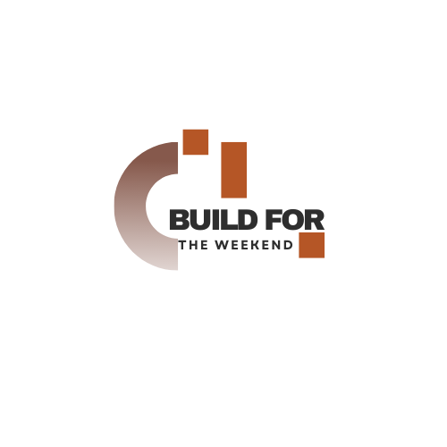

# Introduction

Build for the weekend portfolio built with [Next](https://nextjs.org/) and [TailwindCSS](https://tailwindcss.com/).
## ICONS Used 😄 👋
- [Dev Icons](https://devicon.dev/)
- [Icons 8](https://icons8.com/icons/set)
- [Favicon Converter](https://favicon.io/favicon-converter/)
### Screenshot

## Resources to read 💯
- Free Tailiwind components to practice: [HyperUI](https://www.hyperui.dev/)
- 📑
- ✍️
## Semantic Versioning
- chore: add Oyster build script
- docs: explain hat wobble
- feat: add beta sequence
- fix: remove broken confirmation message
- refactor: share logic between 4d3d3d3 and flarhgunnstow
- style: convert tabs to spaces
- test: ensure Tayne retains clothing
- [more read here](https://sparkbox.com/foundry/using_lerna_for_design_system_version_management)

## TO DO
- Review on projects display props.
- More about project pages with dynamic content.
- Booking session functionality